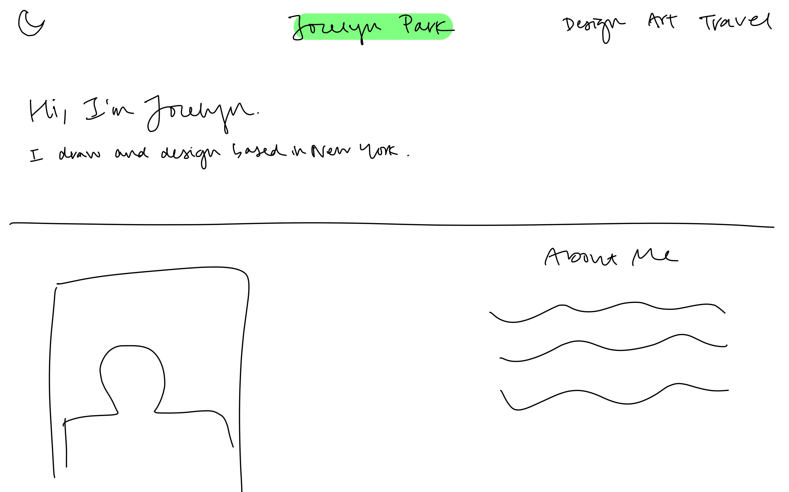
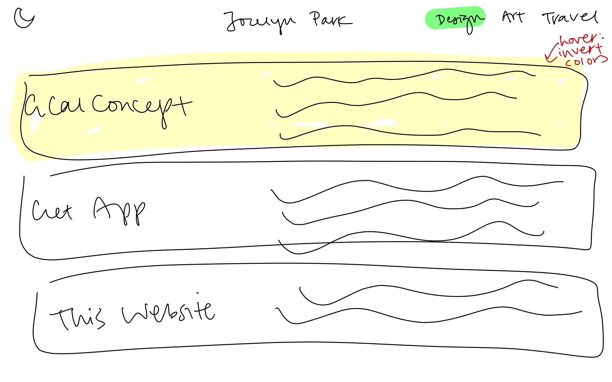
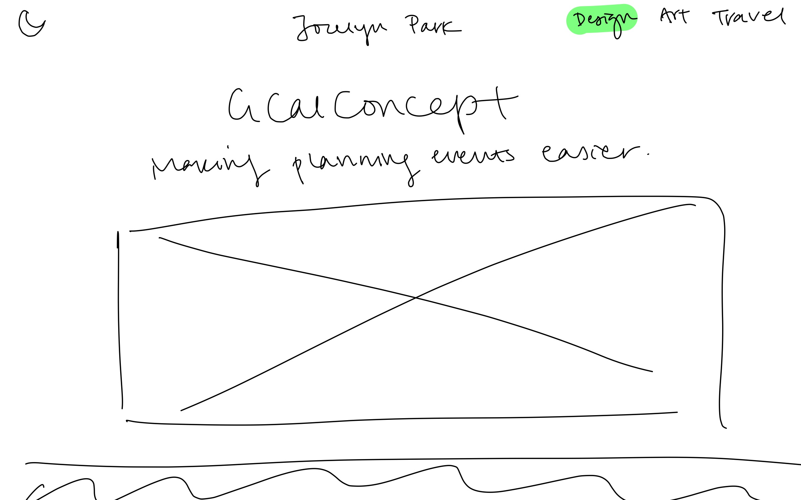
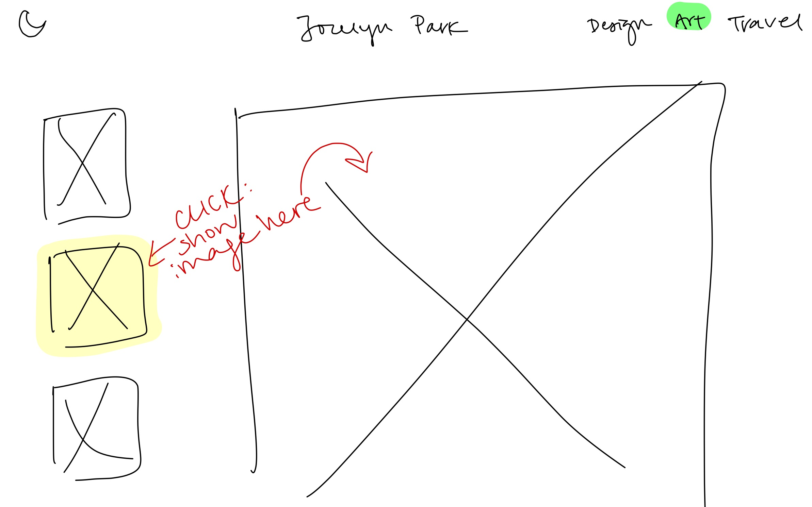
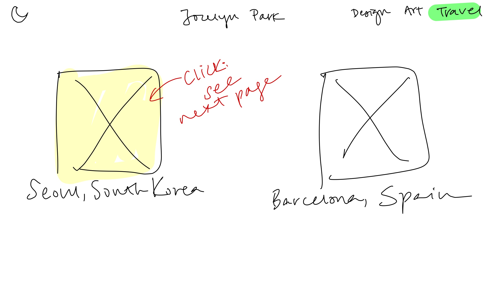
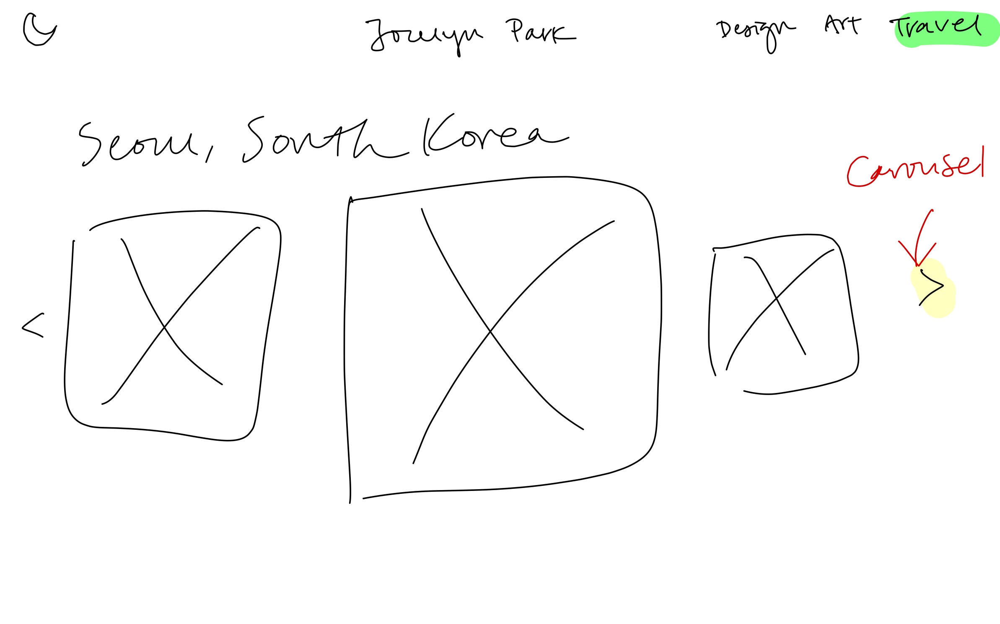
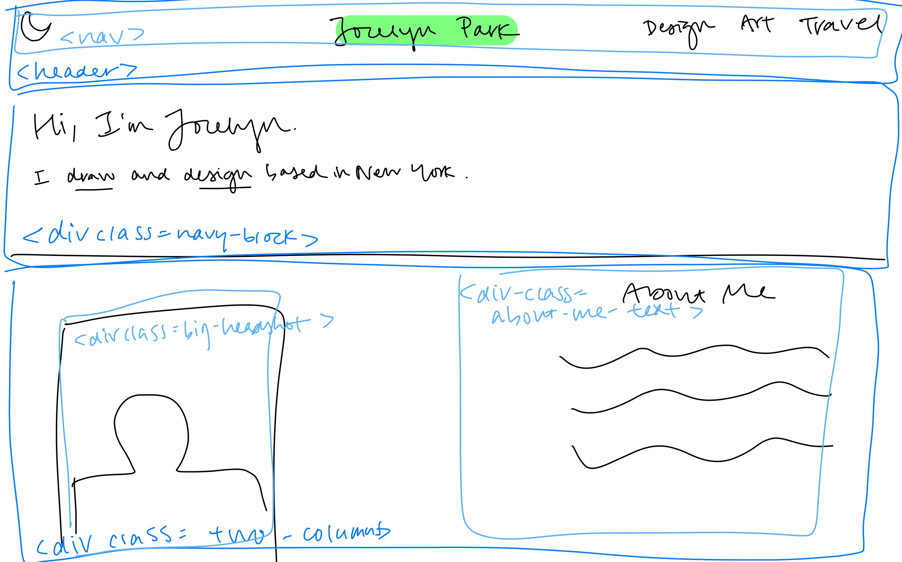
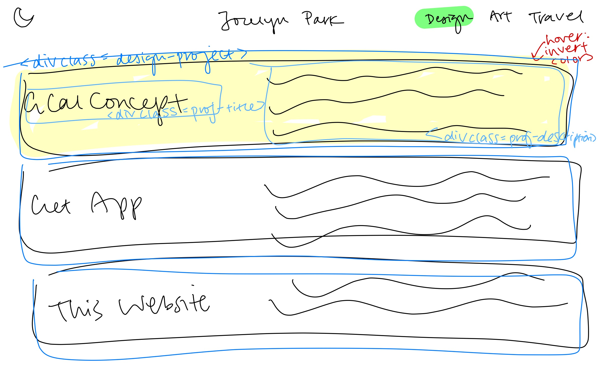
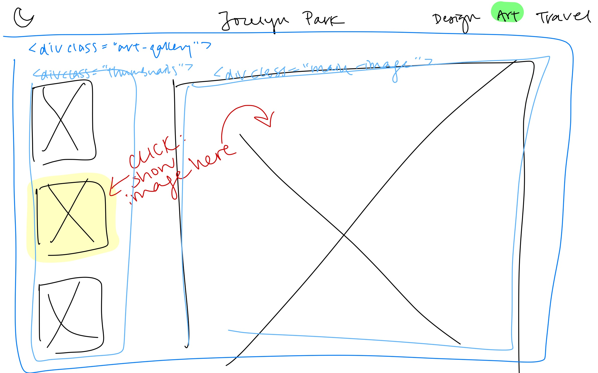
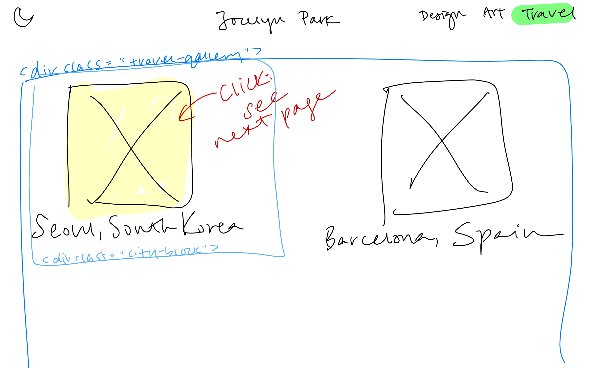

# Project 3: Design Journey

**For each milestone, complete only the sections that are labeled with that milestone.** Refine all sections before the final submission.

You are graded on your design process. If you later need to update your plan, **please do not delete the original plan, leave it in place and append your new plan _below_ the original.** Then explain why you are changing your plan. Any time you update your plan, you're documenting your design process!

**Replace ALL _TODOs_ with your work.** (There should be no TODOs in the final submission.)

Be clear and concise in your writing. Bullets points are encouraged.

**Everything, including images, must be visible in _Markdown: Open Preview_.** If it's not visible in the Markdown preview, then we can't grade it. We also can't give you partial credit either. **Please make sure your design journey should is easy to read for the grader;** in Markdown preview the question _and_ answer should have a blank line between them.


## Existing Project (Milestone 1)

**Tell us about the project you'll be using for Project 3.**

### Project (Milestone 1)
> Which project will you add interactivity to enhance the site's functionality?

Project 1


### Audience (Milestone 1)
> Briefly explain your site's audience.
> Be specific and justify why this audience is a **cohesive** group.

My intended audience is future employers interested in hiring a web designer. This audience is appropriate for my site's topic because I am able to showcase my portfolio and past works in a site about myself.

### Audience's Goals (Milestone 1)
> List the audience's goals that you identified in Project 1 or 2.
> Simply list each goal. No need to include the "Design Ideas and Choices", etc.
> You may adjust the goals if necessary.

1. View past artwork/design work.
2. Learn more about my technical background.
3. Analyze and identify my style of design.


## Interactivity Design (Milestone 1)

### Interactivity Brainstorm (Milestone 1)
> Using the audience goals you identified, brainstorm possible options for interactivity to enhance the functionality of the site while also assisting the audience with their goals.
> Briefly explain each idea and provide a brief rationale for how the interactivity enhances the site's functionality for the audience.
> Note: You may find it easier to sketch for brainstorming. That's fine too. Do whatever you need to do to explore your ideas.

- Idea 1: Carousel for my artwork.
  - The carousel allows viewers to see an abundance of images without actually touching anything, yielding a more passive interaction with elements on the screen.
- Idea 2: Hamburger menu for narrow screens.
  - The hamburger menu allows for a more compact section for the page links, giving the screen more space for the content for the current page. It also separates the navigation from the actual content more clearly on a narrower screen.
- Idea 3: Make image bigger when clicked in a gallery.
  - For my artwork, instead of just doing one big gallery, I can make it interactive by having the image clicked on by a user bigger on the screen. This way, the image is highlighted if the user is curious about it.
- Idea 3: Show/hide facts about me in shown/hidden boxes.
  - An interaction on a page where viewers can click on a category box of things they can learn about me (interests, hobbies, links to other pages such as Instagram, Youtube, Beli) lets viewers only see what they want to know about me, and doesn't overwhelm them with a ton of biography text they aren't asking for.


### Interactivity Design Ideation (Milestone 1)
> Explore the possible design solutions for the interactivity.
> Sketch several iterations of your interactivity.
> Annotate each sketch explaining what happens when a user takes an action. (e.g. When user clicks this, something else appears.)

Home Page


Design Page



Art Page


Travel Page



### Final Interactivity Design (Milestone 1)
> Create _polished_ sketch(es) (it's still a sketch, but with a little more care taken to communicate ideas clearly to the graders) to plan your interactivity.
> **Sketch out the entire page where your interactivity will go.**
> Include your interactivity to the sketch(es).
> Add annotations to explain what happens when the user takes an action.
> Include as many sketches as necessary to communicate your design (ask yourself, could another 1300 take these sketches an implement my design?)

Home Page


Design Page


Art Page


Travel Page


### Interactivity Rationale (Milestone 1)
> Describe the purpose of your proposed interactivity.
> Provide a brief rationale explaining how your proposed interactivity addresses the goals of your site's audience.
> This should be about a paragraph. (3-5 sentences)

My proposed interactivity addresses the goals of my site's audience because it allows them to easily interact with each page based on their needs. For example, for my artwork, because of the added interactivity making clicked images larger, viewers can see the image better and more clearly. On my design page, now that there is interactivity allowing users to choose a project I worked on, there is more room for users to go between different projects, rather than just scrolling through them.


## Interactivity Implementation Plan (Milestone 1)

### Interactivity Planning Sketches (Milestone 1)
> Produce planning sketches that include all the details another 1300 student would need to implement your interactivity design.



Design Page



Art Page


Travel Page



### Interactivity Pseudocode Plan (Milestone 1)
> Write your interactivity pseudocode plan here.
> Pseudocode is not JavaScript. Please do not put JavaScript code here.

```
hover over .design-project: (hover-event snippet)
  invert colors

when #art-image-2 clicked: (on-click-event snippet)
  add .hidden to #art-image-1
  add .hidden to #art-image-3
  remove .hidden from #art-image-2

when #next-button clicked: (on-click-event snippet)
  show next slide (next slide snippet)
```


### "Ambitious" Interactivity Explanation (Milestone 1)
> In your own words, concisely explain why you believe your interactivity meets the "ambitious" requirement.
> This should be a few sentences. (1-3 sentences)

My interactivity meets the "ambitious" requirement because it demonstrates that I have learned and exploited skill sets in interactions between the user and my site. For every one of my interactions, the user has a fulfilling experience where they are cued to take action, and can find a way to complete their task.


## Grading (Final Submission)

### Interactivity Usability Justification (Final Submission)
> Explain how your design effectively uses affordances, visibility, feedback, and familiarity.
> Write a large paragraph (4-6 sentences)

My design, including a carousel of images and a hamburger menu for interactivity, effectively uses affordances by changing the cursor to a pointer when it hovers over a link. My next and previous buttons in my carousel do this as well, and indicate which direction the images go. My design effectively uses visibility by using icons that indicate what they do. For example, the next and previous buttons are within the carousel pointing in opposite directions. Feedback is utlized in areas such as the hamburger menu, where if it's clicked, the dropdown fades down. As for familiarity, links are a different color, which is conventional for web design. Carousels usually have arrows on the left and right, which I implemented as well.


### Tell Us What to Grade (Final Submission)
> We aren't re-grading your Project 1 or 2.
> We are only grading the interactivity you added.
> Tell us where (what pages) we can find your interactivity and how to use it.
> **We will only grade what you list here;** if it's not listed, we won't grade it.

scripts/carousel.js
scripts/hamburger.js
index.html
travel.html
barcelona.html
madrid.html
seville.html


### Collaborators (Final Submission)
> List any persons you collaborated with on this project.

N/A


### Reference Resources (Final Submission)
> Please cite any external resources you referenced in the creation of your project.
> (i.e. W3Schools, StackOverflow, Mozilla, etc.)

W3Schools, StackOverflow, Mozilla


### Self-Reflection (Final Submission)
> This was the first project in this class where you coded some JavaScript. What did you learn from this experience?

How to code creatively. I was able to express myself through code, which I feel like I haven't been able to do much until now.


> Take some time here to reflect on how much you've learned since you started this class. It's often easy to ignore our own progress. Take a moment and think about your accomplishments in this class. Hopefully you'll recognize that you've accomplished a lot and that you should be very proud of those accomplishments!

I had some experience in HTML and CSS before, but this was the first time I was able to make a more interactive website with Javascript. I'm proud of what I ended up with and feel like I can use this project to showcase my skillsets in web development.
